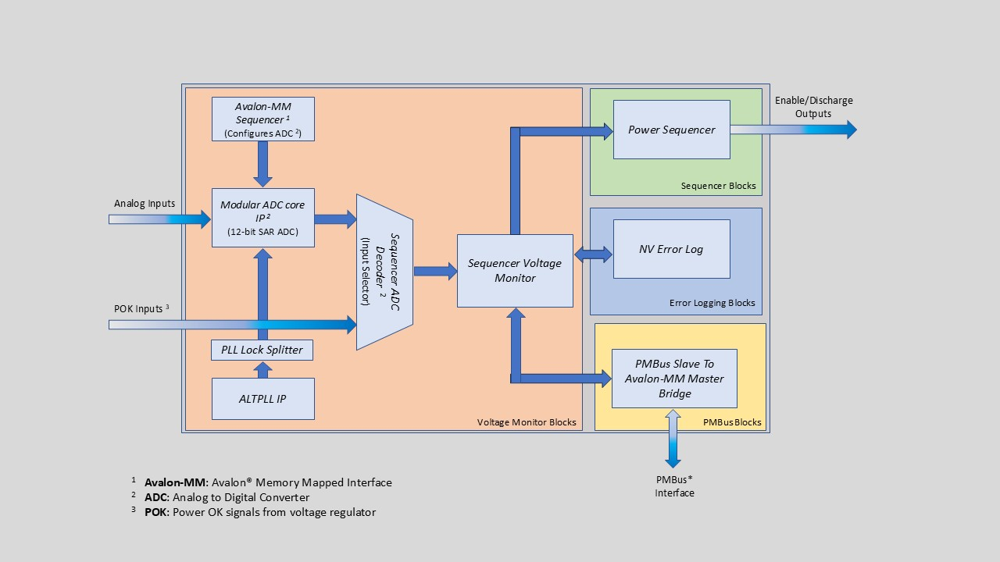

# Multi-Rail Power Sequencer & Monitor
The Multi-Rail Power Sequencer and Monitor is a highly parameterizable set of intellectual property (IP) blocks that can be customized to meet your power sequencing needs.

## Description
The Multi-Rail Power Sequencer and Monitor offers the following functionality:

- Controls the enable sequence of up to 143 output rails
- Can be distributed across multiple Altera® MAX® 10 devices to increase the number of monitored channels
- Allows any combination of power good inputs and monitored voltage rails.

The sequencing can be based on voltages reaching a certain threshold and timed events. It offers parameterizable levels of glitch filtering on power good or voltage inputs, customizable retry responses, a comprehensive Power Management Bus (PMBus*) interface, and numerous other options to tailor the sequencer to the needs of your application.

### Features
- Sequence and monitor any combination of up to 144 rails:
- Up to 18 voltage-monitored rails per Altera® MAX® 10 device
- Up to 144 digital-monitored power good rails
- Monitor overvoltage, undervoltage, and power good status
- Easily configurable via Platform Designer GUI
- Compliant agent interface: PMBus* v1.2 
- Programmable noise filtering on analog input samples and debouncing (28 delay levels) of digital power good inputs
- Latch all warning and fault conditions until cleared
- Set defaults and dynamically control levels for overvoltage, undervoltage, and power good
- Programmable response behavior for overvoltage and undervoltage events
- Configurable delays between sequencing of rails, the qualification window, discharge, and retries
- Cascade or instantiate multiple times within the same device as independent controllers
- Validate behavior with the included simulation test bench

## Current Release
Latest version: 25.1, June 17, 2026

## Project Details​
Title: Multi-Rail Power Sequencer and Monitor Reference Design  
Source: GitHub​  
Family: MAX V, MAX 10  
Quartus Version: 25.1  
URL: https://github.com/altera-fpga/max-ed-power-sequencer

## Getting Started
If you wish to download the entire repository, you can clone the repo using
'git', or download an archive of the repo using a web download utility like
'curl' or 'wget', or use the GitHub download GUI from a web browser.

To clone the project repo with 'git' use a command like this:

    git clone https://github.com/altera-fpga/max-ed-power-sequencer.git

To download an archive of the project with 'wget' or 'curl' use a command like
this:

    wget https://github.com/altera-fpga/max-ed-power-sequencer/archive/master.zip

### Repository Structure

The following objects appear in the top level directory of this project.

**[./docs](./docs)**
* Contains documentation for the reference design.

**[./quartus](./quartus)**
* Contains an example design for a full-featured six-rail sequencer.

**[./source](./source)**
* Contains all of the design files for the Multi-Rail Power Sequencer and Monitor design.

**[./source/sequencer_qsys_tb](./source/sequencer_qsys_tb)**
* Contains simulation support files for the testbench that enables one to simulate the example design using the Siemens® ModelSim® / QuestaSim® simulation tool.

 

[Download latest release](https://github.com/altera-fpga/max-ed-power-sequencer/releases/latest)

## Documentation​
* **Title**: Multi-Rail Power Sequencer and Monitor Reference Design User Guide
* **URL**: https://docs.altera.com/r/docs/683778/current/an-896-multi-rail-power-sequencer-and-monitor-reference-design
* **Title**: Release Notes
* **URL**: https://github.com/altera-fpga/max-ed-power-sequencer/blob/master/CHANGELOG.md

## Get Help
[Report an Issue](https://github.com/altera-fpga/max-ed-power-sequencer/issues)
